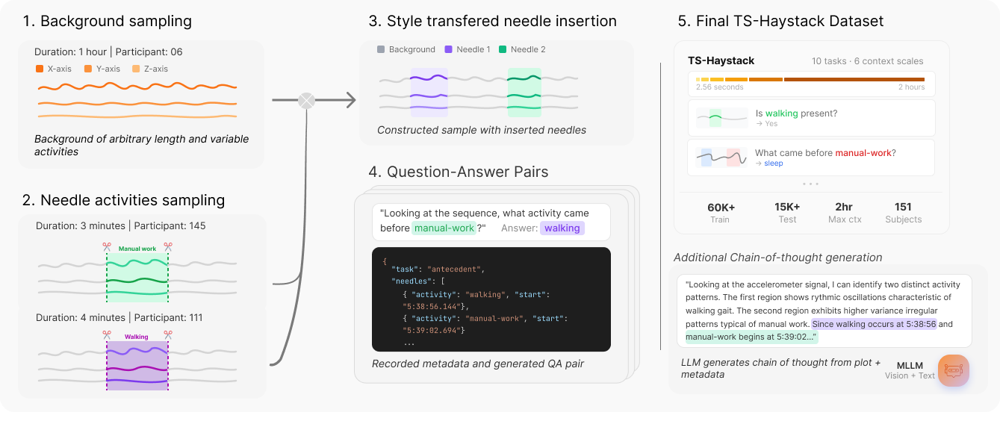

# TS-Haystack

A semi-synthetic benchmark for testing retrieval and reasoning over long time series (1K-1M+ datapoints) using Capture-24 accelerometer data.

> **Update [03/02/2026]:** 🇧🇷 TS-Haystack has been accepted into ICLR TSLAM 2026!

<p align="center">
  
</p>

## Overview

TS-Haystack generates controlled question-answer pairs over long time series by inserting carefully crafted "needle" activities into realistic backgrounds from the Capture-24 dataset. It covers 10 distinct tasks (existence detection, temporal localization, counting, ordering, state query, antecedent reasoning, comparison, multi-hop localization, anomaly detection, and anomaly localization) across context lengths from 2.56 seconds to 2 hours.

The benchmark enables systematic evaluation of time series language models' ability to find, reason about, and compare events across long-range contexts — analogous to "needle in a haystack" evaluations for text-based LLMs, but for continuous sensor data.

## Quick Start

### Option A: Download Pre-Generated Dataset from HuggingFace

```bash
pip install ts-haystack[download]

# Download the CoT (chain-of-thought) dataset
python scripts/download_from_hf.py --dataset ts-haystack-cot

# Or download only core artifacts for local generation
python scripts/download_from_hf.py --dataset ts-haystack-core

# Dry run to see what would be downloaded
python scripts/download_from_hf.py --dry-run
```

### Option B: Generate From Scratch

Requires raw Capture-24 data.

```bash
pip install ts-haystack

# 1. Download raw Capture-24 sensor data
python scripts/download_from_hf.py --dataset capture24-raw

# 2. Build Phase 1 artifacts (timelines, bout index, transition matrix)
python scripts/build_core_artifacts.py --n-jobs 8

# 3. Generate task datasets
python scripts/generate_dataset.py --config configs/default_generation_config.yaml

# 4. (Optional) Generate CoT rationales
pip install ts-haystack[cot]
python scripts/generate_cot.py --context-lengths 100 --tasks all
```

## Loading the Dataset

```python
import polars as pl

# Load a specific task/context-length/split
df = pl.read_parquet("data/capture24/ts_haystack/tasks/100s/existence/train/data.parquet")

print(f"Samples: {len(df)}")
print(f"Columns: {df.columns}")

# Access a sample
sample = df.row(0, named=True)
print(f"Task: {sample['task_type']}")
print(f"Question: {sample['question']}")
print(f"Answer: {sample['answer']}")
print(f"Time series length: {len(sample['x_axis'])} samples")
```

### Parquet Schema

| Column | Type | Description |
|--------|------|-------------|
| `x_axis`, `y_axis`, `z_axis` | List[float] | 3-axis accelerometer data |
| `task_type` | str | Task name (e.g., "existence") |
| `context_length_samples` | int | Window size in samples |
| `recording_time_start` | str | Human-readable start time |
| `recording_time_end` | str | Human-readable end time |
| `question` | str | Generated question |
| `answer` | str | Ground truth answer |
| `answer_type` | str | boolean, integer, category, time_range, or timestamp |
| `needles` | str (JSON) | Inserted needle metadata |
| `difficulty_config` | str (JSON) | Generation parameters |
| `is_valid` | bool | Validation status |

## Task Overview

| # | Task | Question Example | Answer Type |
|---|------|-----------------|-------------|
| 1 | Existence | "Is there walking in this recording?" | boolean |
| 2 | Localization | "When did the walking bout occur?" | time_range |
| 3 | Counting | "How many walking bouts occurred?" | integer |
| 4 | Ordering | "Did walking occur before sitting?" | boolean/category |
| 5 | State Query | "What was the activity level at 7:15 AM?" | category |
| 6 | Antecedent | "What activity occurred before walking?" | category |
| 7 | Comparison | "What was the longest period of walking?" | time_range |
| 8 | Multi-Hop | "When did the 2nd walking bout occur after sitting?" | time_range |
| 9 | Anomaly Detection | "Is there an anomaly in this recording?" | boolean |
| 10 | Anomaly Localization | "Is there an anomaly, and if so, when?" | time_range |

## Architecture

The generation pipeline has four phases:

**Phase 1 — Core Artifacts** (one-time):
- `TimelineBuilder`: Extracts activity bouts from Capture-24 accelerometer data
- `BoutIndexer`: Creates cross-participant index for fast sampling
- `TransitionMatrix`: Learns activity transition probabilities

**Phase 2 — Sampling & Style Transfer** (per sample):
- `BackgroundSampler`: Samples pure or mixed background windows
- `NeedleSampler`: Samples activity needles from the bout index
- `StyleTransfer`: Adapts needle statistics to match background via covariance projection and boundary blending

**Phase 3 — Task Generation** (per sample):
- 10 task generators create diverse Q/A pairs with inserted needles
- Each uses dependency-injected Phase 2 components
- `PromptTemplateBank` provides natural language diversity

**Phase 4 — CoT Generation** (optional):
- LLM-based chain-of-thought rationale generation
- Adds a `rationale` column to parquet files

```
Capture-24 data ──► TimelineBuilder ──► BoutIndexer ──► TransitionMatrix
                                              │                  │
                                              ▼                  ▼
                                    BackgroundSampler    NeedleSampler
                                              │                  │
                                              └───────┬──────────┘
                                                      ▼
                                    StyleTransfer + PromptTemplateBank
                                                      │
                                                      ▼
                                            TaskGenerator (x10)
                                                      │
                                                      ▼
                                             data.parquet files
```

## Creating Your Own Samples

The pipeline is not limited to Capture-24 — you can use any time series source by implementing custom `BackgroundSampler` and `NeedleSampler` instances:

```python
from ts_haystack.core import (
    BackgroundSampler, NeedleSampler, StyleTransfer,
    PromptTemplateBank, SeedManager, BoutIndexer,
    TimelineBuilder, TransitionMatrix,
)
from ts_haystack.tasks import get_task_generator
from ts_haystack.core.data_structures import DifficultyConfig

# Load Phase 1 artifacts
timelines = TimelineBuilder.load_all_timelines()
bout_index = BoutIndexer.load_index()
transition_matrix = TransitionMatrix.load()

# Initialize Phase 2 components
seed_manager = SeedManager(master_seed=42)
bg_sampler = BackgroundSampler(timelines, bout_index, source_hz=100)
needle_sampler = NeedleSampler(bout_index, transition_matrix, source_hz=100)
style_transfer = StyleTransfer(transfer_mode="mean_only", blend_mode="cosine")
template_bank = PromptTemplateBank()

# Create a task generator
TaskClass = get_task_generator("existence")
generator = TaskClass(
    background_sampler=bg_sampler,
    needle_sampler=needle_sampler,
    style_transfer=style_transfer,
    template_bank=template_bank,
    seed_manager=seed_manager,
    source_hz=100,
)

# Generate samples
difficulty = DifficultyConfig(
    context_length_samples=10000,
    needle_position="random",
    needle_length_ratio_range=(0.02, 0.10),
    background_purity="pure",
)

samples = generator.generate_dataset(
    n_samples=100,
    difficulty=difficulty,
    split="train",
    n_jobs=4,
)
```

## Configuration

Dataset generation is controlled via YAML configuration. See `configs/default_generation_config.yaml` for all parameters.

Key options:

| Parameter | Description |
|-----------|-------------|
| `context_lengths_seconds` | Window sizes in seconds (e.g., 2.56, 10, 100, 900, 3600, 7200) |
| `needle_length_ratio_range` | Needle duration as fraction of context (e.g., [0.02, 0.10]) |
| `background_purity` | "pure" (single activity), "mixed" (multiple activities), or "any" |
| `needle_position` | "random", "beginning", "middle", or "end" |
| `style_transfer.transfer_mode` | "mean_only" (recommended) or "full" (covariance projection) |
| `style_transfer.blend_mode` | "cosine" or "linear" boundary blending |

```bash
# Print default config to customize
python scripts/generate_dataset.py --print-default-config > my_config.yaml

# Validate config without generating
python scripts/generate_dataset.py --config my_config.yaml --dry-run
```

## Output Directory Structure

```
data/capture24/ts_haystack/
├── timelines/P*.parquet          # Per-participant activity timelines
├── bout_index.parquet            # Cross-participant bout index
├── transition_matrix.json        # Activity transition probabilities
└── tasks/
    ├── 2_56s/                    # 256 samples at 100Hz
    ├── 10s/                      # 1,000 samples
    ├── 100s/                     # 10,000 samples
    │   ├── existence/
    │   │   ├── train/data.parquet
    │   │   ├── val/data.parquet
    │   │   ├── test/data.parquet
    │   │   └── metadata.json
    │   ├── localization/
    │   └── ...
    ├── 900s/                     # 90,000 samples (~15 min)
    ├── 3600s/                    # 360,000 samples (1 hour)
    └── 7200s/                    # 720,000 samples (2 hours)
```

## Scripts

| Script | Description |
|--------|-------------|
| `scripts/download_from_hf.py` | Download datasets from HuggingFace Hub |
| `scripts/build_core_artifacts.py` | Build Phase 1 artifacts from raw Capture-24 data |
| `scripts/generate_dataset.py` | Generate task datasets using YAML configuration |
| `scripts/generate_cot.py` | Generate LLM-based chain-of-thought rationales |
| `scripts/inspect_dataset.py` | Inspect generated parquet files in readable JSON |
| `scripts/aggregate_eval_results.py` | Aggregate model evaluation metrics |

## Development

```bash
# Install with dev dependencies
pip install -e ".[all]"

# Run tests
pytest tests/ -v

# Run specific task tests
pytest tests/tasks/ -v

# Lint
ruff check src/
ruff format src/
```

## Citation

If you use TS-Haystack in your research, please cite:

```bibtex
@misc{Zumarraga2026TSHaystack,
  title        = {TS-Haystack: A Multi-Scale Retrieval Benchmark for Time Series Language Models},
  author       = {Zumarraga, Nicolas and Kaar, Thomas and Wang, Ning and Xu, Maxwell A. and Rosenblatt, Mark and Kreft, Markus and O'Sullivan, Kevin and Schmiedmayer, Paul and Langer, Patrick and Jakob, Robert},
  year         = {2026},
  eprint       = {2602.14200},
  archivePrefix= {arXiv},
  primaryClass = {cs.LG},
  url          = {https://arxiv.org/abs/2602.14200},
}
```

## License

This project is licensed under the MIT License. See [LICENSE](LICENSE) for details.
